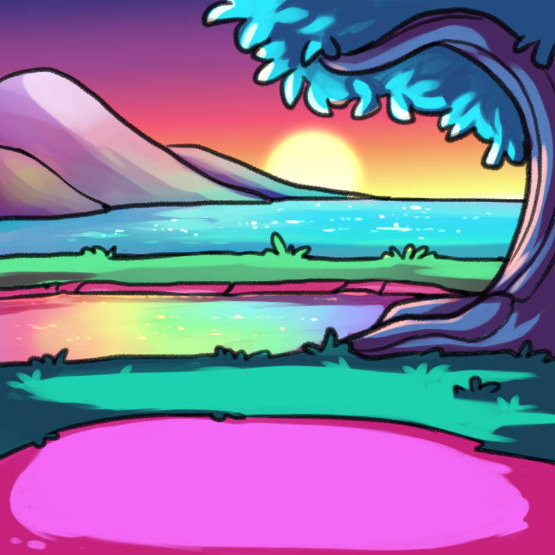
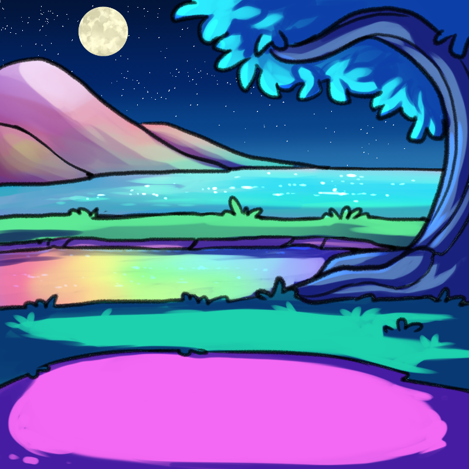

# Prism Engine Documentation

This comprehensive documentation aims to provide the reader with all of the
information required to produce assets for an NFT collection using Prism.

## Philosophy

### Art

When we created Prism Engine, we wanted to reduce the gap in the tools available
to generative artists versus the tools available to digital 1/1 artists.

Traditionally, generative art has been quite a linear process, with artists only
really being able to work generatively in terms of layers. Layers are an 
important part of digital art, but they're not the only things we work with, and
they're often restrictive when it comes to lighting, shading, and composing art.

One thing we wanted to be able to work with directly was color. The Glitterflies
had over twenty color schemes, and the last thing we wanted to do was put
together twenty differently-colored versions of the same layer for every trait
value, so we created a rendering engine that could color the art dynamically.

Next, blending modes are really important for light and shadow, so we added the
ability to use all of the blending modes which people take for granted when
working digitally (multiply, add, screen, etc).

### Code

From a very early stage, we decided that the code needed to fit a few 
parameters which would set Prism up for success:

  - The code should be **written in a performant language**, which would allow 
    for generation of large and complex collections in a reasonable timeframe. 
    We chose Clojure for this because it gave us access to the large number of 
    JVM-based rendering packages without the verbosity of Java.
  - The code should **be able to resume from a failed generation***. No one 
    wants to start from 0 again if the power goes out or they stop the 
    generation to do something else.
  - The code should **produce output compatible with Metaplex's tools**. Candy
    Machine is the standard in the Solana space, and we don't want to reinvent
    the wheel for minting NFTs.

We want Prism Engine to be easy to use, but we have always prioritized power and
configurability above all else. We want easy things to be easy, and hard things
to be possible.

### Separation of concerns

In order to make these changes, we had to separate concerns:

  - We use `decisions` to determine which `outcomes` we want to render;
  - We use `outcomes` to determine how to render them;
  - We use `resources` to determine what we can work with.

This means that you're not having to deal with all of these at the same time,
which we had to do with the first iteration of Prism, and made for seriously
obtuse config files.

### A Word of Warning

By separating these concerns, we have made it possible to generate trait sets
which do not directly correspond to the art rendered on the NFT. This is a
deliberate decision, but you may not want it.

In order to guarantee that the link remains, you will have to do two things:

  - 1. Each outcome which renders art NEEDS to set an `attribute`; AND
  - 2. No outcome should override the `attribute` set by another.

## Preparing the Art

Prism is not opinionated about how your art is organized, you will be able to
configure the locations of all of your files as you wish. 

If you want to use dynamic coloring, all of the layers which you wish to 
dynamically color need to be white (#FFFFFF). If they are not white, the color 
will be applied as a 'tint', meaning that it will be combined with the existing
layer coloring.

Sometimes, this makes things complex. If you want to have multiple colors on a
single object, they will generally need to have one source file each (see the
Tutorial section for examples**.

## Configuration

This section deals with writing a configuration file for Prism. There are some
[sample configs in the tutorial directory](./tutorial/config) if you want to see
what they look like when put together.

### Format

Prism configs are written in 
[Extensible Document Notation](https://github.com/edn-format/edn), which is a
format unique to Clojure. 

This may seem like an odd choice, when everything else is using YAML or JSON,
but using EDN allowed us to write code directly in the config, which is simpler
than trying to learn a JS-or-YAML-based pseudocode. The format is pretty easy to
understand, and supports a broader set of data structures than JSON.

### Sections

The configuration is split into sections:

#### `config`

The `config` section handles collection-level configuration options. For more 
information, you can read [here](./configuration/config.md).

#### `base`

The `base` section describes the defaults for all NFTs in the collection. For 
more information, you can read [here](./configuration/base.md).

#### `pregenerate`

The `pregenerate` section describes the pre-generated or 1/1 NFTs. For more
information, you can read [here](./configuration/pregenerate.md).

#### `decisions`

The `decisions` section describes how to determine outcomes, step-by-step. 
For more information, you can read [here](./configuration/decisions.md).

#### `outcomes`

The `outcomes` section describes how to apply the outcomes to the NFT. For more
information, you can read [here](./configuration/outcomes.md).

#### `resources`

The `resources` section describes everything the rendering engine needs to
create images. For more information, you can read 
[here](./configuration/outcomes.md).

## Running

This documentation explains how Prism works, and is optional reading for most
users. It's provided for people who want a better understanding of the technical
architecture because they want to debug complex issues or contribute to Prism.

### Workflows

To understand how Prism builds assets, starting from a config file, check out
[this document](./running/workflows.md).

### Database

To understand the Prism database model, check out 
[this document](./running/database.md).

### Operating Modes

When Prism loads:

  - if you choose a database file which already exists, Prism will continue to 
  generate the collection specified by that database file. This will ignore all
  changes to the config.
  - if you choose to create a new database file, Prism will generate a new
  collection entirely.

## Tutorial

This tutorial details how to create a very simple collection using Prism. It
explains how to use dynamic coloring, lighting, blending modes, and rarity. It
is not designed to be a replacement for reading the detailed documentation but 
rather as a companion to that documentation.

### Differences

Where the text of the tutorial differs from the configs, the configs are correct.

### The Source Files

**Note: All source files and sample images are Copyright (C) 2022 Yume Labs.
You may use them for the purposes of practicing with the Prism rendering engine
but you are not authorized to use them, or works derived from them, in any 
commercial NFT collection.**

#### Backgrounds

There are three sample backgrounds:





These are the only colored layers you'll find in the source files because we'll 
use Prism to apply color to the other layers generatively.

#### Others

You can find all of the assets we'll use [here](./tutorial/res). This will be a
simple collection with very few attributes, but Prism can be used to compile as
complex a dataset as you want.

### Config

This section will explain, step-by-step, how we write a config for this sample
collection using more and more features which Prism Engine offers.

#### Basic Config

The basic config can be found [here](./tutorial/config/basic.edn).

There are several steps which we need to go through to define a collection
configuration, we're going to skim over the collection-level stuff and what all
of the options are here (more details earlier in this document) and focus on
specific config for the traits and their outcomes.

First of all, what are our traits?

  - Background: Day, Sunset, Night
  - Body Color: Cream, Grey
  - Secondary Color: Red, Blue, Green
  - Eye: Open, Closed
  - Eye Color (if open): Red, Blue, Green
  - Gender: Male, Female

These are represented by the config here:

```clojure
{:decisions [{:name :background
              :type :random
              :outcomes [:day :sunset :night]}
             {:name :body-color
              :type :random
              :outcomes [:cream :grey]}
             {:name :secondary-color
              :type :random
              :outcomes [:red :blue :green]}
             {:name :eyes
              :type :random
              :outcomes [:open :closed]}
             {:name :eye-color
              :filter (fn (processed) (not (= (:eyes processed) :open)))
              :type :random
              :outcomes [:red :blue :green]}
             {:name :gender
              :type :random
              :outcomes [:male :female]}]}
```

These are fairly simple, but let's unpack one anyway to make sure that we know
how they work, and what's going on.

  - `:name` defines the name of the decision. This isn't necessarily the
    same as the name of the attribute, because a single decision can define
    0-N attributes, but it's often the same;
  - `:type` defines the type of the decision. All of these are random, which
    is a fairly common type for decisions. It just means to select a random
    outcome from `:outcomes` and record it;
  - `:outcomes` are the possible outcome resolvers. Again, these aren't 
    necessarily the same as attribute values, but they often are;
  - `:filter` is used on the `:eye-color` decision, because the eye color
    layer will only be rendered if the eyes are open. This is a Clojure function
    which accepts the outcomes so far, and expects a `true` or `false` return 
    value. Don't worry if this doesn't make too much sense, almost all filters
    will be a near copy-paste of this one on most collections, but it allows for
    logic as complex as your collection needs.

This just defines outcomes though, so we need to go to the `:outcomes` config to
understand how these map to attributes (or traits) and image changes:

```clojure
{:outcomes {:background 
             {:day [[:attribute "Time" "Day"]
                    [[:layers :background] {:image [:images :background :day]}]]
              :sunset [[:attribute "Time" "Sunset"]
                       [[:layers :background] {:image [:images :background :sunset]}]]
              :night [[:attribute "Time" "Night"]
                      [[:layers :background] {:image [:images :background :night]}]]}
            :body-color
             {:cream [[:attribute "Body" "Cream"]
                      [[:layers :body] {:color [:colors :cream]}]]
              :grey [[:attribute "Body" "Grey"]
                     [[:layers :body] {:color [:colors :grey]}]]}
            :secondary-color
             {:red [[:attribute "Markings" "Red"]
                    [[:layers :secondary] {:color [:colors :red]}]]
              :blue [[:attribute "Markings" "Blue"]
                     [[:layers :secondary] {:color [:colors :blue]}]]
              :green [[:attribute "Markings" "Green"]
                      [[:layers :secondary] {:color [:colors :green]}]]}
            :eyes
             {:open [[:attribute "Eyes" "Open"]
                     [[:layers :eyes-outline] {:image [:images :eyes-outline :open]}]
                     [[:layers :eyes-highlight] {:image [:images :eyes-highlights]}]
                     [[:layers :eye-color] {:image [:images :eye-color]}]]
              :closed [[:attribute "Eyes" "Closed"]
                       [:attribute "Eye Color" "None"]
                       [[:layers :eyes-outline] {:image [:images :eyes-outline :closed]}]]}
            :eye_color
             {:red [[:attribute "Eye Color" "Red"]
                    [[:layers :eye-color] {:color [:colors :red]}]]
              :blue [[:attribute "Eye Color" "Blue"]
                     [[:layers :eye-color] {:color [:colors :blue]}]]
              :green [[:attribute "Eye Color" "Green"]
                      [[:layers :eye-color] {:color [:colors :green]}]]}
            :gender
             {:male [[:attribute "Gender" "Male"]]
              :female [[:attribute "Gender" "Female"]]}}}
```

As we can see, these are a little more complex, but when we unpack them, they're
still very simple:

  - At the top of the tree are all of the `:name` fields from the previous step;
  - Each of these keys is mapped to a value object, each of which contains the
    `:outcomes` for that step;
  - Each `:outcome` is mapped to a list of changes.

The changes themselves are each represented by a list: the value to update is
the first argument, and the parameters for that update follow. Here we mostly 
see changes to the raw data (`[:layers :xyz]`), these simply update/replace the
corresponding value in the `:base` part of the config (see above) with the value
in the second argument.

We also see some `:attribute** modifiers, these are a
slightly different case, in which we pass in two arguments to add or replace an
attribute on the NFT.

**Note: Yes, it is possible as in the case of `[:eyes :closed]` to set multiple
attributes from a single outcome. Here, we know that closed eyes will always
result in no visible eye color, so we can just set it from here.**

#### Matching Colors

This config can be found [here](./tutorial/config/matching.edn)

This deliberate disconnect between `outcomes` and `attributes` allows for some
pretty cool things. When we were rendering **The Glitterflies**, we could have
just allowed any color to go anywhere, but instead, we put all of the colors
into `Chroma`, a description of an entire color scheme. This allowed us to
guarantee that every Glitterfly would have some level of color cohesiveness.

To do that here, we'd replace the `body-color` and `secondary-color` outcomes 
with a single outcome: `color-scheme`:

```clojure
{:decisions [...
             {:name :color-scheme
              :type :random
              :outcomes [:strawberry :blueberry :midnight :coder]}
             ...]
 :outcomes {...
            :color-scheme 
             {:strawberry [[:attribute "Color Scheme" "Strawberry"]
                           [[:layers :body] {:color [:colors :cream]}]
                           [[:layers :secondary] {:color [:colors :red]}]]
              :blueberry [[:attribute "Color Scheme" "Blueberry"]
                          [[:layers :body] {:color [:colors :cream]}]
                          [[:layers :secondary] {:color [:colors :blue]}]]
              :midnight [[:attribute "Color Scheme" "Midnight"]
                         [[:layers :body] {:color [:colors :grey]}]
                         [[:layers :secondary] {:color [:colors :blue]}]]
              :coder [[:attribute "Color Scheme" "Coder"]
                      [[:layers :body] {:color [:colors :grey]}]
                      [[:layers :secondary] {:color [:colors :green]}]]}
            ...}}
```

Now, we have one less attribute, and no more cream/green or grey/red NFTs.

#### Lighting

The full config for this is [here](./tutorial/config/lighting.edn)

Let's talk about something that's difficult to do with any other rendering
engine, but trivial to do with Prism. We have three backgrounds: day, sunset,
and night. Instead of keeping our colors the same, this means that we can light
our character dynamically: brightest in the day, darkest at night, and orange
tinted at sunset.

```clojure
:outcomes {...
           :background 
            {:day [...
                   [[:layers :highlights] {:color [:colors :day-highlights]}]
                   [[:layers :shadows] {:color [:colors :day-shadows]}]
                   ...]
             :sunset [...
                      [[:layers :highlights] {:color [:colors :sunset-highlights]}]
                      [[:layers :shadows] {:color [:colors :sunset-shadows]}]
                      ...]
             :night [...
                      [[:layers :highlights] {:color [:colors :night-highlights]}]
                      [[:layers :shadows] {:color [:colors :night-shadows]}]
                      ...]}
           ...}
```

Note: We could go a *lot* further with this. We could tint the characters
themselves, we could use different blending modes for day, sunset and night,
we could even use different lighting/shadow layers entirely as well as different
colors to correctly depict the sun at different levels and coming from different
directions as it traverses the night sky.

Gone are the days of flat-looking NFTs, here to stay are the days of playing
with highlights, shadows, color tinting, bounce lights, etc.

#### Rarity

The config for this is [here](./tutorial/config/rarity.edn).

Everything so far has dealt with every outcome being equally rare. Naturally,
this isn't how most NFTs work. So, let's say we want to add rarity, with open
eyes being 3x as rare as closed, and night being 3x as rare as day, and 2x as
rare as sunset. How do we do that?

Simple, change the decisions:

```clojure
{:decisions [...
             {:name :background
              :type :random
              :outcomes [{:name :day :weight 3} 
                         {:name :sunset :weight 2} 
                         {:name :night :weight 1}]}
             {:name :eyes
              :type :random
              :outcomes [{:name :open :weight 3} 
                         {:name :closed :weight 1}]}
             ...]}
```

When we have a bare keyword like `:day`, this is expanded by the pre-processor
to `{:name :day :weight 1}`. We need to use the full syntax to add weights.

#### De-Duping Twins

Most collections do not want twins, and Prism has a simple method of locating
and deleting twins from the collection. In the `:config` section, there are two
attributes:

  - `:no-twins` should be set to `true`.
  - `:twin-outcomes` should be a list of outcomes to determine what a twin is.
    For example, we may wish not to account for `:gender` because a male and
    female with all other attributes the same would still render identical 
    images (the typical definition of a twin).

### Generating a Collection

See [the main README](../README.md).
